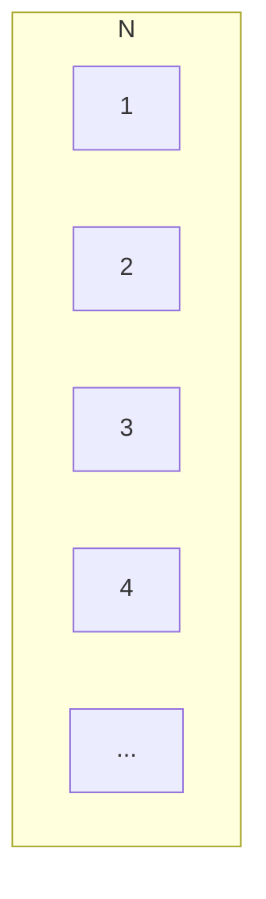
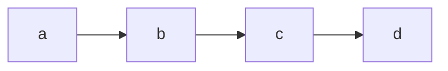
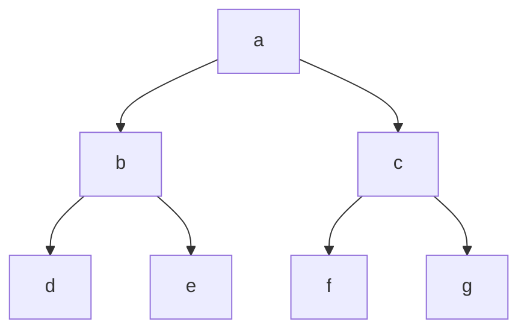
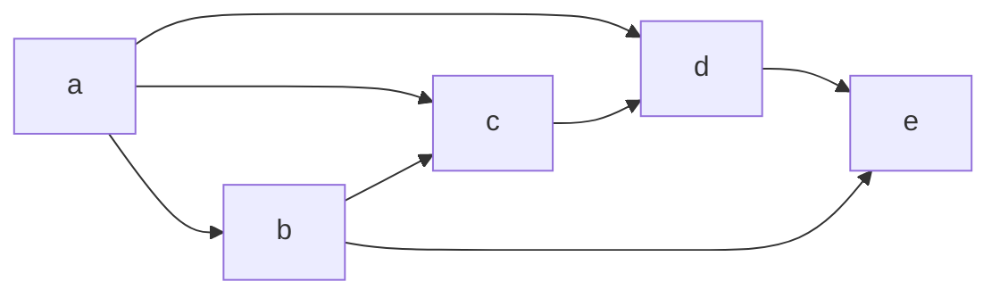

## 第一章 绪论

### 1. 基本概念与术语

#### 1.1 数据、数据元素、数据项

**数据**
数据包括：
* 数值性的数据：整数、实数。
* 非数值性的数据：文字、图像、图形、声音等。

数值性的数据容易进行运算

**数据元素**
数据元素是数据是基本单位，数据元素内的信息关系比较紧密，操作时需要将所有信息作为一个整体考虑。比如一个学生表中每一行的数据与那个同学相关，当我们需要添加或者删除数据的时候，需要整行操作。数据元素简称为元素，又称为记录、节点或者顶点。
|学号|姓名|性别|出生日期|政治面貌|
|----|----|----|--------|--------|
|001|鲁豫|男|1999/09/01|团员|
|002|李明|男|1999/05/15|党员|
|003|王霞|女|1999/12/31|团员|

**数据项**
数据元素内部可以又若干个数据项组成，是构成元素时不可分割的最小单位。比如表格中每一格的内容。

三者的关系是：
数据 > 数据元素 > 数据项
比如：学生表格 > 一个学生 > 学生的学号

**数据对象**
性质相同的数据元素的集合就是数据对象，它是数据的一个子集。
比如：
* **整数**数据对象是集合$ N = \begin{Bmatrix} 0,\pm1, \pm2 \end{Bmatrix}$。
* **字母字符**数据对象是集合$ C = \begin{Bmatrix} 'A','B',...,'Z'\end{Bmatrix}$。
* **学籍表**也可以看作一个数据对象。

数据元素是集合的个体，而数据对象是性质相同的数据元素的集合。

#### 1.2 数据结构

数据元素不是孤立存在的，他们之间存在着某种关系，数据元素相互之间的关系就叫做结构。数据结构就是相互之间存在一种或多种特定关系的数据元素的集合。

数据结构包括以下三个方面的内容：
1. 数据元素之间的逻辑关系，也称为<font color = orange>逻辑结构</font>。
2. 数据元素之间及其关系在计算机内存中的表示（又成为映像），称为数据的<font color = orange>物理结构</font>或数据的储存结构。
3. 数据的<font color = orange>运算或实现</font>，即对数据元素可以施加的操作以及这些操作在相应的存储结构上的实现。

* <font color = orange>逻辑结构</font>
描述数据之间的逻辑关系，与数据的存储无关，独立于计算机。是从具体问题之中抽象出来的。

* <font color = orange>物理结构（存储结构）</font>
数据元素以及数据元素及其关系在计算机存储器中的结构，是数据结构在计算机中的表示。

* <font color = orange>逻辑结构与存储结构的关系</font>
    * 存储结构是逻辑关系映像与元素本事的映像；
    * 逻辑结构是数据结构的抽象，存储结构是数据结构的实现；
    * 两者综合起来建立数据元素之间的结构关系。

##### 1.2.2 逻辑结构的种类
<font color = orange>划分方法一：</font>
1. 线性结构
    有且仅有一个开始和终端节点，并且所有节点最多只有一个直接前趋和一个直接后继。数据元素之间是一对一的关系。
    例如：线性表、栈、队列、串

2. 非线性结构
    一个节点后可能又多个直接前趋和直接后继
    例如：树、图

<font color = orange>划分方法二：</font>
1. 集合：
结构中的数据元素之间除了同<font color = orange>属于一个集合</font>的关系外，无任何其他关系。


2. 线性
结构中的数据元素之间存在着<font color = orange>一对一</font>的线性关系。



3. 树
结构中的数据元素之间存在着<font color = orange>一对多</font>的线性关系。


4. 图
结构中的数据元素之间存在着<font color = orange>多对多</font>的任意关系。



##### 1.2.2 存储结构的种类
四种基本存储结构：
* <font color = orange>顺序存储结构：</font>
  * 用一组<font color = #4169E1>连续</font>的存储单元<font color = #4169E1>依次</font>存储数据元素，数据元素之间的逻辑关系由元素的<font color = #4169E1>存储位置</font>来表示。
  * Cpp语言中用数组来实现顺序存储结构。
  例如：`array<int, 3> L = {1,2,3};`

* <font color = orange>链式存储结构：</font>
  * 用一组<font color = #4169E1>任意</font>的存储单元存储数据元素，数据元素之间的逻辑关系用<font color = #4169E1>指针</font>来表示。
  * C++语言中用指针来实现链式存储结构。
  ```mermaid
  classDiagram
    class Head
    Head: &a1

    class a1
    a1: &a2

    class a2
    a2: &a3

    class a3
    a3: &a4

    class a4
    a4: null
    
    Head --> a1
    a1 -->a2
    a2 -->a3
    a3 -->a4
  ```
  例如：
    ```cpp
    typedef struct SingleLinkNode 
    {                                          //单链表的储存结构定义
	    int data;                          //节点的数据域
	    struct SingleLinkNode *next;       //节点的指针域
    } SingleLinkNode, *Linklist;               //LinkList为指向结构体的指针类型
    ```
* <font color = orange>索引存储结构：</font>
    * 在存储节点信息的同时，还建立附加的索引表(Index)；
    * 索引表中的每一项称为一个索引项；
    * 索引项的一般形式是：（关键字，地址）；
    * 关键字是能唯一标识一个节点的那些数据项；
    * 若每个节点在索引表中都有一个索引项，则该索引表称为稠密索引表(Dense Index)。若一组节点在索引表中只对应一个索引项，则该索引表称为稀疏索引表(Sparse Index)。
    * 
* <font color = orange>散列存储结构：</font>
  * 根据节点的关键字直接计算出该节点的存储位置。
  

##### 1.2.3 数据类型和抽象数据类型
C++中的数据类型可以参考我的知乎文章：
* [C++ 学习日志 -- 7](https://zhuanlan.zhihu.com/p/394890380)
* [C++ 学习日志 -- 8](https://zhuanlan.zhihu.com/p/395273156)

数据类型的作用：
* 约束常量变量的取值范围
* 约束常量变量的操作
  
**<font color = orange>抽象数据类型(Abstract Data Type, ADT)：</font>**

抽象数据类型是指一个数学模型以及定义在此数学模型上的一组操作。
* 由用户定义，从问题抽象出<font color = orange>数据模型</font>（逻辑结构）
* 还包括定义在数据模型上的一组<font color = orange>抽象运算</font>（相关操作）
* 不考虑计算机内的具体存储结构于运算的具体实现算法
  
抽象数据类型的形式定义：
抽象数据类型、可用使用（D，S，P）<font color = orange>三元组</font>表示：
其中：
D是数据对象；
S是D上的关系集；
P是对D的基本操作集。
```cpp
ADT 抽象数据类型名{
    数据对象:<数据对象的定义>
    数据关系:<数据关系的定义>
    基本操作:<基本操作的定义>
} ADT 抽象数据类型名
```
### 2. 抽象数据类型的表现与实现
例如：抽象数据类型“复数”的实现,下面的代码是跟着老师写的，但跑不出来，这个等我再学一段时间CPP后再修改这个代码。
```cpp
#include <iostream>
#include <cmath>

struct Complex
{
    float realpart;  //实部
    float imagpart;  //虚部
};

void assign(Complex * A, float real, float imag); // 赋值
void add(Complex * A, float real, float imag); // A + B
void minus(Complex * A, float real, float imag); // A - B
void multiply(Complex * A, float real, float imag); // A * B
void divide(Complex * A, float real, float imag); // A / b

void assign(Complex * A, float real, float imag)
{
    A -> realpart = real;
    A -> imagpart = imag;
} // 赋值函数

void add(Complex * c, Complex A, Complex B) 
{
    c->realpart = A.realpart + B.realpart;
    c->imagpart = A.imagpart + B.imagpart;
} // 复数相加

void minus(Complex * c, Complex A, Complex B) 
{
    c->realpart = A.realpart - B.realpart;
    c->imagpart = A.imagpart - B.imagpart;
} // 复数相减

void multiply(Complex * c, Complex A, Complex B) 
{
    c->realpart = A.realpart*A.imagpart - B.realpart*B.imagpart;
    c->imagpart = B.realpart*A.imagpart - A.realpart*B.imagpart;
} // 复数相减

void divide(Complex * c, Complex A, Complex B) 
{
    c->realpart = A.realpart*A.imagpart + B.realpart*B.imagpart/(pow(A.realpart) + pow(B.imagpart));
    c->imagpart = B.realpart*A.imagpart + A.realpart*B.imagpart/(pow(A.realpart) + pow(B.imagpart));
} // 复数相减

/* 计算 */
int main(int argc, char *argv[])
{
    Complex z1,z2,z3,z4,z;
    float RealPart, ImagPart;
    assign(z1,9,6);
    assign(z2,4,3);
    add(z3,z1,z2);
    multiply(z4,z3,z1);
    divide(z,z4,z3);

    return 0;
}
```

### 3. 算法和算法分析

#### 3.1 算法与程序
* **<font color = #4169E1>算法</font>**是解决问题的一种方法或过程，考虑如何将输入转换为输出，一个问题可以有多种算法。
* **<font color = #4169E1>程序</font>**是用某种语言设计语言对算法的具体实现。

**程序 = 数据结构 + 算法**
* 数据结构通过算法实现操作
* 算法根据数据结构设计程序

**<font color = orange>算法的特性：（5个）</font>**
* **有穷性**：算法的步骤必须是有穷的，且每一步执行的时间是有穷的。
* **确定性**：算法的每一条指令必须要有确定的含义，没有二义性，在任何条件下，只有唯一的执行路径，即对于相同的输入只能得到相同的输出。
* **可行性**：算法必须是可行的。
* **输入**：一个算法有零个或多个输入。
* **输出**：一个算法必须有一个或多个输出。

**<font color = orange>程序设计的要求：（5个）</font>**
**正确性**：
**可读性**：
**健壮性（鲁棒性）**：
* 指当输入非法数据时，算法恰当的做出反应或进行相应的处理，而不是产生莫名其妙的输出结果。
* 处理出错的方法，不应是中断程序的执行，而是应该返回一个错误性质的值或者表示错误，以便在更高的抽象层次上进行处理。


**高效性**：
* 画尽量少的时间和尽量少的内存
  
#### 3.2 算法分析
在一个算法具备正确性和健壮性和可读性后，就需要考虑算法的效率。一般从两个方面来考虑：
* <font color = red>时间效率</font>：算法所耗费的时间；
* <font color = red>空间效率</font>：算法所耗费的储存空间。
一般情况下，时间和空间的效率是矛盾的。

**算法的时间效率**：
例如，两个n*n矩阵的相乘算法：
```cpp
for (i=i;i<=n;i++)      // n+1次
{
    for (j = 1; j<=n;j++)   // n(n+1)次
    {
        c[i][j] = 0;        // n*n次
        for(k=0;k<n;k++>)       // n*n*(n+1)次
        {
            c[i][j] = c[i][j] + a[i][k]*b[k][j]; //n*n*n次
        }
    }
}
```
我们通过上面的方法就可以算出算法的时间消耗T(n)为：
$$T(n) = 2n^3+3n^2+2n+1$$

但是这样的算法太麻烦了，我们每一步的次数都要算出来，那么简单的方法是，我们只比较步骤的数量级。T(n) = O(f(n)), O(f(n))为算法的渐进时间复杂度。又称为<font color = #4169E1>时间复杂度</font>。那么刚才那个算法的时间复杂度就是：
$$T(n) = O(n^3)$$

总的来说就是：算法中基本语句的重复执行的次数是问题规模n的某个函数f(n)，算法的时间量度记作：T(n) = O(f(n))。O(f(n))是f(n)函数的增长率。

问题规模n，具体到问题有：
* 排序：n为记录数；
* 矩阵：n为矩阵的阶数；
* 多项式：n为多项式的项数；
* 集合：n为元素的个数；
* 树：n为树的结点个数；
* 图：n为图的顶点数或边数。